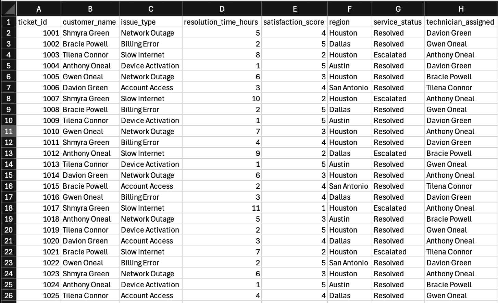
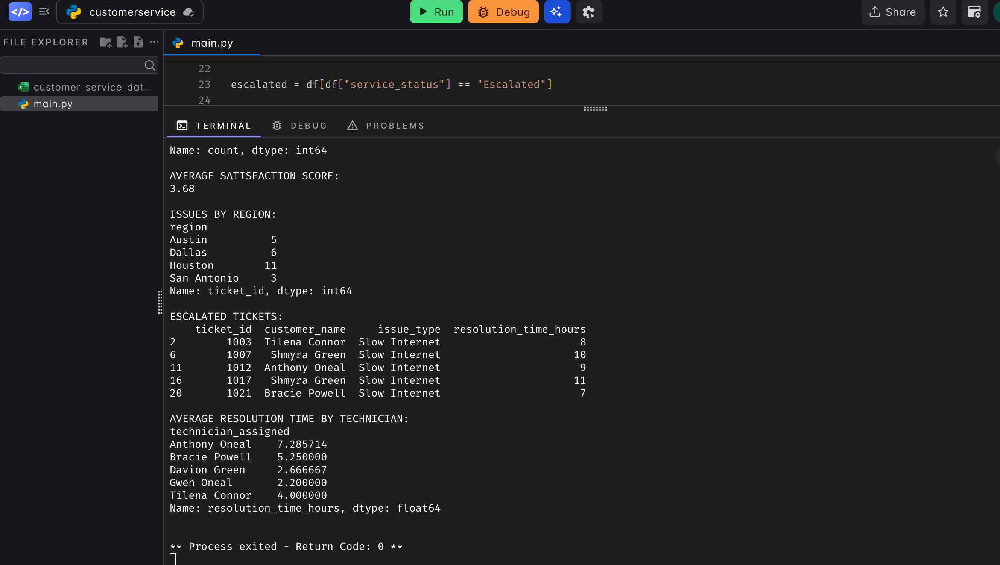

# Customer Service Operations Analytics

This project analyzes customer service operational data using Python and pandas. It reviews service tickets, issue types, resolution times, escalation patterns, customer satisfaction scores, and technician performance.

## Project Purpose

The purpose of this project is to demonstrate how operational data can be cleaned, analyzed, and reported to support data-driven decision-making.

## Tools Used

- Python
- pandas
- CSV
- GitHub

## Key Features

- Analyzes customer service ticket data
- Calculates average resolution time
- Identifies the most common service issues
- Reviews customer satisfaction trends
- Tracks escalated tickets
- Compares resolution time by technician
- Generates a summary reporting output

## Dataset

The dataset includes sample customer service tickets with the following fields:

- Ticket ID
- Customer Name
- Issue Type
- Resolution Time
- Satisfaction Score
- Region
- Service Status
- Technician Assigned

## Business Value

This project simulates how analysts use operational data to identify trends, improve service visibility, and support reporting accuracy.

## Files Included

- `customer_service_data.csv`
- `service_operations_analysis.py`
- `requirements.txt`
- `generated_reports/operations_summary.csv`
## Project Preview

### Dataset Example

### Python Analysis Output

## Skills Demonstrated

- Python
- pandas
- Data Analysis
- Operational Analytics
- Reporting
- CSV Data Processing
- Trend Analysis
- Data Cleaning
- Business Reporting
